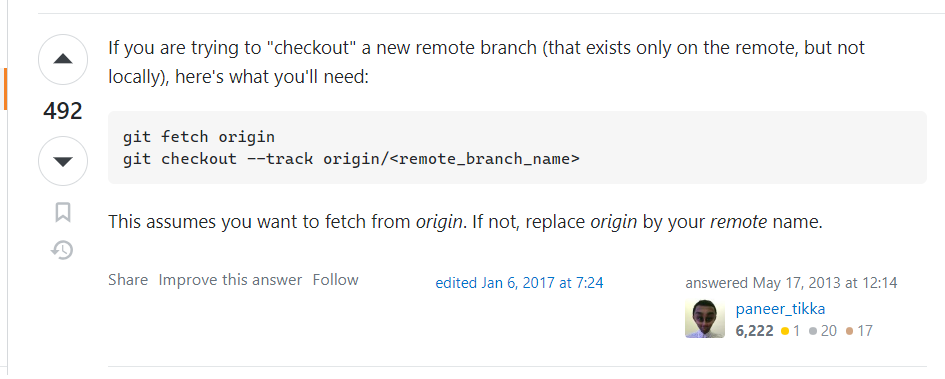
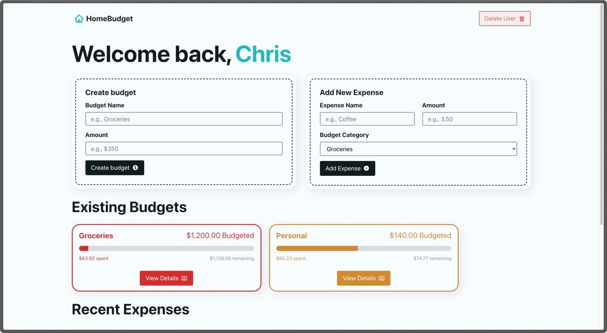

# React Router Budget App

During this course, we’ll build an interactive budget app using React Router 6.8 and local storage.

## Push to other branches

 
 

# Homepage
 

## This is Homepage of the Program

